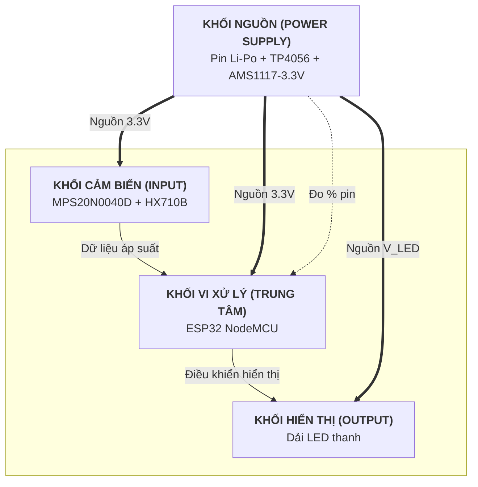

```mermaid
flowchart TB
    %% HÀNG TRÊN: INPUT -> VXL -> OUTPUT
    subgraph HE_THONG_XU_LY[" "]
        direction LR
        S["<b>KHỐI CẢM BIẾN (INPUT)</b><br>MPS20N0040D + HX710B"]
        M["<b>KHỐI VI XỬ LÝ (TRUNG TÂM)</b><br>ESP32 NodeMCU"]
        L["<b>KHỐI HIỂN THỊ (OUTPUT)</b><br>Dải LED thanh"]

        S --> |Dữ liệu áp suất| M
        M --> |Điều khiển hiển thị| L
    end

    %% HÀNG DƯỚI: KHỐI NGUỒN
    P["<b>KHỐI NGUỒN (POWER SUPPLY)</b><br>Pin Li-Po + TP4056 + AMS1117-3.3V"]

    %% DÒNG CẤP NGUỒN TỪ DƯỚI LÊN
    P ==> |Nguồn 3.3V| S
    P ==> |Nguồn 3.3V| M
    P ==> |Nguồn V_LED| L
    P -.-> |Đo % pin| M
```
